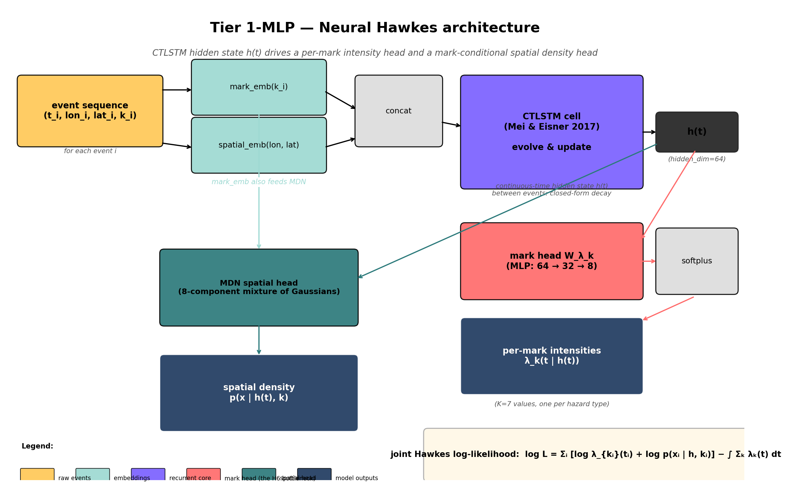
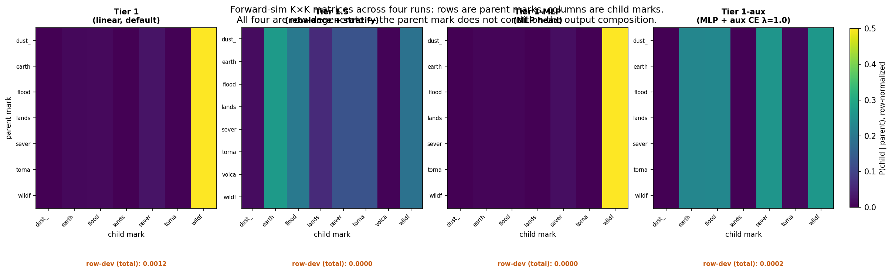
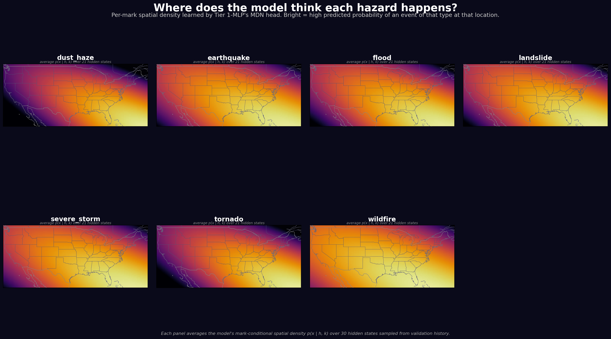
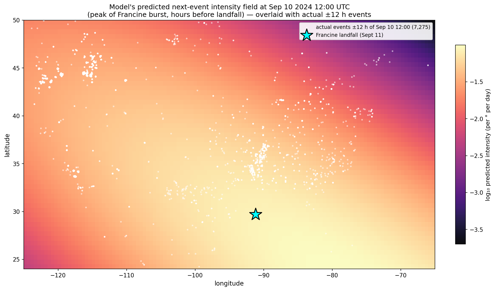

# eonet-cascades

Spatio-temporal point-process benchmark for natural-hazard event cascades
over CONUS and Mexico, 2000–present.

## Background

Natural hazards do not fire independently: a hurricane drives floods and severe
storms, and drought precedes wildfire bursts. This project characterizes the
cascade structure of natural hazards: which event types trigger which others,
with what time lag and what spatial signature, and how stationary that structure
is across years and regions.

Operationally, the target is the K×K cross-mark excitation matrix of a
multivariate point process: row *i*, column *j* is the degree to which events of
type *i* raise the near-future rate of type *j*. That matrix is the cascade
graph, and recovering it interpretably is the main output.

Three model tiers share a common likelihood interface and evaluation harness, so
they are directly comparable on held-out log-likelihood:

1. Parametric multivariate Hawkes: interpretable closed-form excitation
   kernels (the cascade matrix read off directly).
2. Neural Hawkes: a continuous-time LSTM intensity, more expressive but
   less directly interpretable.
3. Transformer Hawkes: attention-based intensity for long-range history.



### The cascade graph

The inferred K×K cross-mark excitation matrix, the object the whole pipeline
estimates:



### Data coverage

Harmonized hazard catalog over CONUS and Mexico (EONET and auxiliary sources),
stored in a DuckDB warehouse:



## Results: 2024 Atlantic storm season (Tier 1)

Evaluated on the Aug–Oct 2024 validation slice, the Tier-1 neural Hawkes model
assigns actual EONET events ~100× higher probability than a marginal-Poisson
baseline, a +4.6 nats/event improvement that is uniform across five independent
storm bursts:

| Burst | n events | Tier 1 | baseline | Δ (nats/event) |
|---|---:|---:|---:|---:|
| Aug 7 cluster | 12,641 | −3.39 | −8.00 | +4.61 |
| Aug 22–23 | 9,495 | −3.26 | −7.83 | +4.57 |
| Francine (Sept 9–10) | 15,420 | −3.16 | −7.77 | +4.60 |
| Oct 5 cluster | 8,195 | −3.22 | −7.78 | +4.56 |
| Milton (Oct 9–10) | 6,115 | −3.14 | −7.86 | +4.72 |

The model's spatial intensity field tracks storms it has never seen. Below is
the predicted next-event intensity over CONUS at the peak of Hurricane Francine
(Sept 10 2024, ~18 h before landfall); white points are the actual events that
fired within ±12 h.



Calibration: the model is well-calibrated on wildfires (the dominant mark) and
pushes rare marks (earthquake, flood, severe storm, tornado) into the
low-likelihood tail rather than assigning them confident wrong probabilities,
which makes inverse log-likelihood usable as a rare-hazard anomaly detector.

> Known limitation: forward-simulation-derived K×K matrices from the neural
> tier are row-degenerate (an encoder-bottleneck pathology, documented in
> `docs/notes/`); the cascade graph is recovered instead from the parametric
> tier and via gradient attribution. The neural tier is a strong forecaster
> with a characterized interpretability limit.

## Quick start

```bash
uv sync --extra dev
uv run eonet --help
uv run pytest
```

## Data location

Raw catalogs and the harmonized DuckDB store live on an external drive by
default:

```
/Volumes/Seagate_Ext/eonet-cascades-data/
```

Override with the `EONET_DATA_ROOT` environment variable or `--data-root` flag.

## License

MIT. See [`LICENSE`](LICENSE).
